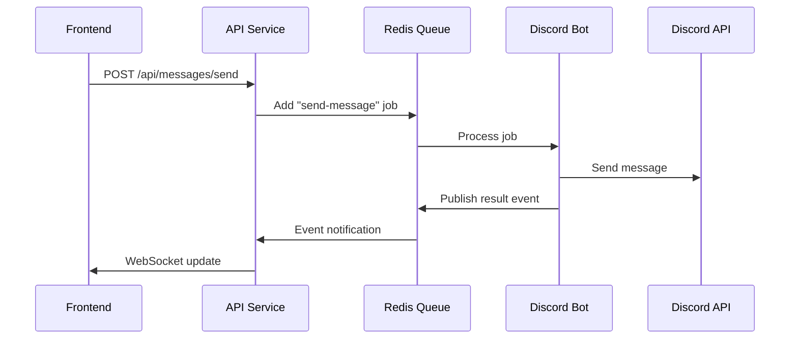

# Discord Bot Microservices - Phase 1 Implementation

🚀 **Discord bot with microservices architecture featuring message queue communication, REST API, and Vue.js dashboard.**

## 🏗️ Architecture Overview

This project implements a microservices architecture for a Discord bot with the following components:

- **🤖 Discord Bot** - Discord.js bot with queue integration (existing + enhanced)
- **🔌 API Service** - Express.js REST API with message queue
- **🌐 Frontend** - Vue.js dashboard for bot management
- **📨 Message Queue** - Redis + Bull for inter-service communication
- **🗄️ Database** - MongoDB with Prisma ORM (existing)

## 📦 Services

```
┌─────────────────┬─────────────────┬─────────────────┐
│   Frontend      │      API        │      Bot        │
│   Port: 3000    │   Port: 3001    │   Discord       │
├─────────────────┼─────────────────┼─────────────────┤
│ Vue 3           │ Express.js      │ Discord.js      │
│ TypeScript      │ TypeScript      │ TypeScript      │
│ Tailwind CSS    │ JWT Auth        │ Prisma          │
│ Vite            │ Socket.io       │ Bull Queue      │
│ Pinia           │ Bull Queue      │ Music Player    │
└─────────────────┴─────────────────┴─────────────────┘
                          │
                    ┌─────▼─────┐
                    │   Redis   │
                    │Port: 6379 │
                    └───────────┘
```

## 🚀 Quick Start

### Prerequisites

- Node.js 20+
- Docker & Docker Compose
- MongoDB database (existing)
- Discord Bot Token

### 1. Clone and Setup

```bash
git clone <repository>
cd Bubbles

# Copy environment file
cp env.example .env

# Edit .env with your values
nano .env
```

### 2. Configure Environment

Update `.env` with your Discord bot credentials:

```env
DISCORD_TOKEN=your_discord_bot_token_here
CLIENT_ID=your_discord_client_id_here
TEST_GUILD_ID=your_test_guild_id_here
DB_URL=your_mongodb_connection_string
DISCORD_CLIENT_SECRET=your_oauth_client_secret
JWT_SECRET=your_jwt_secret_key
```

### 3. Start All Services

```bash
# Start all services with Docker Compose
npm run dev

# Or build and start
npm run dev:logs
```

### 4. Access Services

- **Frontend Dashboard**: http://localhost:3000
- **API Health Check**: http://localhost:3001/health
- **Queue Dashboard**: http://localhost:3002 
- **Redis**: localhost:6379

## 🔧 Development

### Individual Service Development

```bash
# Start specific services
docker-compose up redis shared api
docker-compose up frontend
docker-compose up bot

# Build all services
npm run build

# Stop all services  
npm run stop

# Clean up containers and volumes
npm run clean
```

### Project Structure

```
Bubbles/
├── shared/          # Shared TypeScript types and utilities
├── api/            # Express.js API service
├── frontend/       # Vue.js dashboard
├── bot/           # Discord.js bot (existing + enhanced)
├── documentation/ # Implementation plans and guides
└── docker-compose.yml
```

## 📋 Phase 1 Features

### ✅ Implemented

- [x] Redis message queue infrastructure
- [x] Shared TypeScript types across services
- [x] Express.js API with health checks
- [x] Vue.js frontend with Tailwind CSS
- [x] Docker Compose multi-service setup
- [x] Bot queue integration (basic structure)

### 🚧 In Progress

- [ ] Message sending from web to Discord
- [ ] Discord OAuth authentication
- [ ] Real-time WebSocket updates
- [ ] Queue job monitoring
- [ ] Error handling and retries

### 📱 Demo Feature: Send Discord Messages

The Phase 1 demo allows sending messages to Discord channels through the web interface:

1. **Web Form** → Submit message via frontend
2. **API Endpoint** → Validate and queue job
3. **Message Queue** → Redis/Bull job queuing
4. **Bot Consumer** → Process job and send to Discord
5. **Event Publishing** → Success/failure feedback

## 🔄 Message Flow Example



## 🛠️ Available Scripts

```bash
# Root project scripts
npm run dev          # Start all services
npm run build        # Build all services  
npm run start        # Production start
npm run stop         # Stop all services
npm run clean        # Clean containers/volumes

# Individual service scripts
cd shared && npm run build    # Build shared types
cd api && npm run dev        # API development
cd frontend && npm run dev   # Frontend development
cd bot && npm run dev        # Bot development
```

## 🐛 Troubleshooting

### Services Not Starting

1. **Check Docker**: Ensure Docker is running
2. **Port Conflicts**: Verify ports 3000, 3001, 6379 are available
3. **Environment Variables**: Verify all required vars are set
4. **Dependencies**: Run `npm install` in each service

### Queue Connection Issues

1. **Redis Health**: Check `docker-compose logs redis`
2. **Network**: Ensure services can reach Redis container
3. **Configuration**: Verify REDIS_HOST=redis in containers

### Bot Not Connecting

1. **Discord Token**: Verify token is valid and bot is in guild
2. **Permissions**: Ensure bot has necessary Discord permissions
3. **Database**: Check MongoDB connection string

## 📚 Next Steps (Phase 2)

- Real-time dashboard with live stats
- Complete moderation interface  
- Music player remote control
- WebSocket real-time updates
- Enhanced authentication system

## 🤝 Contributing

This is Phase 1 of the implementation. Focus areas:

1. **Queue Communication** - Enhance message passing
2. **Error Handling** - Improve resilience  
3. **Authentication** - Complete Discord OAuth
4. **UI/UX** - Enhance dashboard interface
5. **Testing** - Add integration tests

## 📖 Documentation

- [Architecture Overview](./documentation/plans/01-architecture-overview.md)
- [Implementation Phases](./documentation/plans/04-implementation-phases.md)
- [API Design](./documentation/plans/06-api-design.md)
- [Message Queue Patterns](./documentation/plans/07-message-queue-patterns.md)

---

**Phase 1 Status**: 🚧 **In Development** - Basic infrastructure complete, features in progress 