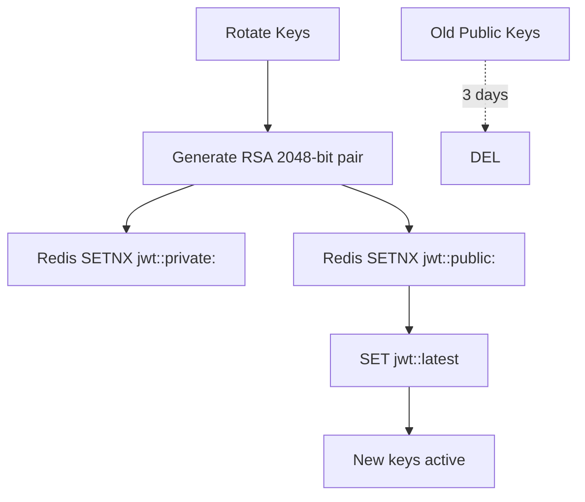

# Bubbles Bot Improvement Plan — Detailed Backlog

_(last updated: <!--DATE_PLACEHOLDER-->, generated UTC)_

---

## 0. Prerequisites & Tooling

| Task                                                                                                                               | Outcome                             |
| ---------------------------------------------------------------------------------------------------------------------------------- | ----------------------------------- |
| Replace **jsonwebtoken** with **jose**                                                                                             | Uniform RS256 JWT handling          |
| Add libs: `pino`, `pino-pretty`, `@opentelemetry/sdk-node`, `@sentry/node`, `cron`, `jose`, `yaml`, `dotenv-flow`, `dotenv-expand` | Foundation for later tasks          |
| Remove `winston`                                                                                                                   | Reduce log overhead                 |
| Create shared utility `JwtKeyManager` in `/shared/src/utils/`                                                                      | Single source of truth for RSA keys |
| Add script `scripts/rotate-keys.ts` to both workspaces                                                                             | Manual rotation fallback            |
| Update CI: run `npm audit --omit=dev` & Renovate                                                                                   | Dependency hygiene                  |

---

## 1. Architectural Clean-up

### 1.a Modularise `Client.ts`

Outcome: ≤ 200 LOC facade; logic split into:

- `EnvironmentValidator`
- `ManagerInitializer`
- `CommandLoader`
- `EventLoader`
- `ShutdownManager`

### 1.b Layered Boundaries

- Create `src/domain/**` (business rules) vs `src/integrations/**` (Discord, DB, cache).
- Refactor until domain code imports **no** Discord.js types.

Dependencies: none.

---

## 2. Performance & Resource Usage

### 2.a Pino Logger

- Migrate to `pino` with JSON output; pretty-print in dev.
- Adapter shim exports `logger.info|warn|error` identical to old API.

### 2.b Lazy-load Commands

- Add `lazy: true` metadata ⇒ `BaseCommand.run` `import()`s module on first use.
- Persist weak-reference map so hot reload retains cache.

### 2.c Guild-level Rate Limiting

- Extend `CooldownStore` ➜ `requestToken({ guildId?, userId })`.
- One-line helper in `Command` base: `await cooldown(this, interaction)`.

Dependencies: Redis.

---

## 3. Observability

| Component     | Key Tasks                                                 | Success Metric            |
| ------------- | --------------------------------------------------------- | ------------------------- |
| OpenTelemetry | Auto-instrument Node, expose `/metrics` histogram buckets | Traces visible in Grafana |
| Sentry        | Capture unhandled rejections in shards, queues, REST      | < 1% uncaught errors      |
| Prometheus    | Extend existing metrics registry with queue & WS metrics  | Dashboards show live data |

---

## 4. Configuration & Secrets

- Replace AJV JSON config with **Zod** schema that also loads `.yaml`.
- Early-load env via `dotenv-flow` + `dotenv-expand` (supports `.env.*`).

---

## 5. Command System Improvements

- **Prune obsolete commands**: during `DiscordAPIAction.Register` diff local vs remote, delete extras.
- **Docs generator**: `scripts/generateCommandDocs.ts` → Markdown in `documentation/generated/commands.md`.

---

## 6. Internationalisation & Accessibility

- Integrate `i18next` with FS backend.
- DB migration: add `preferredLanguage` to `GuildConfig`.

---

## 7. Reliability & Ops

- Add `/health` route to **bot metrics server**.
  - Simple JSON: `{ overall, timestamp, components, metrics }`.
  - HTTP status: 200=healthy, 206=degraded, 503=unhealthy.
- Keep existing `/metrics` untouched.

---

## 8. Developer Experience

- **Hot reload command** `/dev reload` (dev-mode only).
- **Interactive log tail** CLI `scripts/tail-logs.ts` piping `pino-pretty`.

---

## 9. Security

### 9.a RSA-Based JWT Key Management (two families)

| Family | Issuer | Audience | Redis Namespace | Purpose                |
| ------ | ------ | -------- | --------------- | ---------------------- |
| `user` | API    | Frontend | `jwt:user`      | OAuth session JWTs     |
| `bot`  | Bot    | API      | `jwt:bot`       | Bot⇄API WebSocket auth |

- Implement `JwtKeyManager` (see Appendix A).
- Default rotation cron:
  - `JWT_ROTATION_CRON_USER="0 4 * * *"`
  - `JWT_ROTATION_CRON_BOT="0 5 * * *"`
- Public keys TTL: 3 days (config `JWT_PUBLIC_TTL_DAYS`).
- Fallback PEM files for local dev: `./keys/user.pem`, `./keys/bot.pem`.

### 9.b Dependency Hygiene

- CI step `npm audit --production` (fail on high severity).
- Renovate auto-merge patch-level upgrades.

---

## 10. Documentation

- Add Mermaid diagrams to `/documentation/plans/diagrams/`:
  - Queue flow
  - Sharding model
  - WebSocket event pipeline
- Cross-link from relevant markdown files.

---

## Appendix A – RSA Key Management Spec

- **Zero-downtime**: tokens embed `kid`; verifier fetches matching public key.
- `JwtKeyManager.getSigner(fam)` caches `kid` + key until pointer changes.
- Cleanup job deletes `jwt:*:public:<kid>` older than TTL.

---

## Appendix B – Environment Variable Reference

| Variable                 | Package | Default     | Notes                      |
| ------------------------ | ------- | ----------- | -------------------------- |
| `JWT_ROTATION_CRON_USER` | api     | `0 4 * * *` | Disable with `false`       |
| `JWT_ROTATION_CRON_BOT`  | bot     | `0 5 * * *` | "                          |
| `JWT_PUBLIC_TTL_DAYS`    | both    | `3`         | Purge old keys             |
| `JWT_KEY_NAMESPACE_USER` | api     | `jwt:user`  | Prefix override            |
| `JWT_KEY_NAMESPACE_BOT`  | bot     | `jwt:bot`   | "                          |
| `METRICS_PORT`           | bot     | `9321`      | Prometheus & /health route |
| `SENTRY_DSN`             | both    | –           | Optional                   |

---

_End of backlog_
