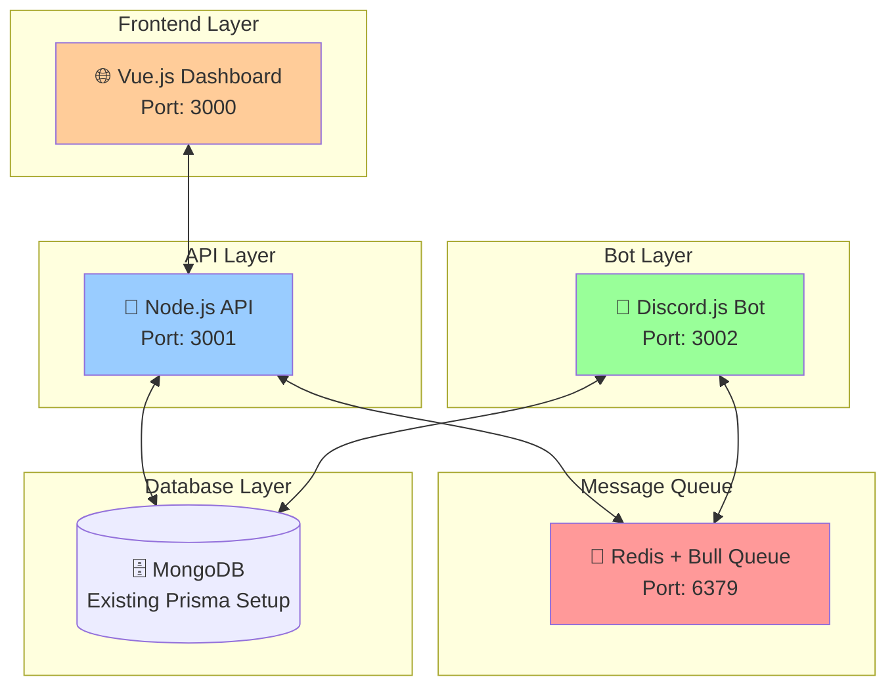

# Microservices Architecture Overview

## 🏗️ System Architecture



## 🎯 Service Responsibilities

### 1. **Vue.js Frontend** (`frontend/`)

- **Purpose**: Web dashboard for server administrators
- **Technology**: Vue 3 + TypeScript + Vite + Tailwind CSS
- **Features**:
  - Server dashboard with real-time stats
  - Moderation case management
  - User lookup and history
  - Bot configuration panel
  - Music player remote control
  - Appeals management interface

### 2. **Node.js API** (`api/`)

- **Purpose**: REST API and WebSocket gateway
- **Technology**: Express.js + TypeScript + Socket.io
- **Features**:
  - RESTful API endpoints
  - Real-time WebSocket connections
  - Authentication & authorization
  - Data aggregation and analytics
  - Message queue producer
  - Database queries and caching

### 3. **Discord Bot** (`bot/`)

- **Purpose**: Discord gateway and command processing
- **Technology**: Discord.js + TypeScript (existing codebase)
- **Features**:
  - Discord event handling
  - Slash command processing
  - Music player management
  - Moderation actions
  - Message queue consumer
  - Database operations

### 4. **Message Queue** (Redis + Bull)

- **Purpose**: Async communication between services
- **Technology**: Redis + Bull Queue
- **Features**:
  - Command routing (Web → Bot)
  - Event broadcasting (Bot → Web)
  - Job scheduling and retries
  - Dead letter queues
  - Real-time notifications

## 🔄 Communication Patterns

### Pattern 1: Web Command Execution

```
User Action on Web → API → Queue → Bot → Discord → Queue → API → Web Update
```

### Pattern 2: Discord Event Propagation

```
Discord Event → Bot → Queue → API → WebSocket → Web Real-time Update
```

### Pattern 3: Configuration Sync

```
Config Change on Web → API → Database + Queue → Bot Config Reload
```

## 🚀 Deployment Strategy

### Development Environment

- **Single Server**: All services on localhost with different ports
- **Docker Compose**: Container orchestration for easy setup
- **Hot Reload**: Development mode with file watching

### Production Environment (Same Server)

- **Reverse Proxy**: Nginx routing to different services
- **Process Management**: PM2 for service management
- **SSL/TLS**: Let's Encrypt certificates
- **Monitoring**: Basic health checks and logging

## 📊 Data Flow Examples

### Example 1: Ban User from Web

1. Admin clicks "Ban User" on web dashboard
2. Frontend sends POST to `/api/moderation/ban`
3. API validates permissions and publishes `BAN_USER` to queue
4. Bot consumes event and executes Discord ban
5. Bot publishes `BAN_COMPLETED` to queue
6. API receives completion and broadcasts via WebSocket
7. Frontend shows real-time "User banned" notification

### Example 2: Live Member Count

1. User joins Discord server
2. Bot detects `guildMemberAdd` event
3. Bot publishes `MEMBER_JOINED` to queue
4. API consumes event and updates database
5. API broadcasts member count update via WebSocket
6. Frontend updates live member counter

## 🔧 Technology Justification

### Why Node.js + TypeScript for API?

- **Consistency**: Same language across all services
- **Type Safety**: Shared TypeScript interfaces
- **Ecosystem**: Rich npm ecosystem for Discord bots
- **Performance**: V8 engine efficiency for I/O operations

### Why Vue.js for Frontend?

- **Learning Curve**: Easier than React for TypeScript beginners
- **Composition API**: Great TypeScript support
- **Ecosystem**: Vuetify/Quasar for rapid UI development
- **Size**: Smaller bundle size than React

### Why Redis + Bull for Message Queue?

- **Free**: Redis is open source and free
- **Simple**: Easy setup and configuration
- **Reliable**: Battle-tested in production
- **TypeScript**: Bull has excellent TypeScript support
- **Features**: Job retries, delays, priorities, monitoring

## 🎯 Success Metrics

### Development Success

- [ ] All services start independently
- [ ] Message queue communication working
- [ ] WebSocket real-time updates functional
- [ ] Docker containerization complete

### Feature Success

- [ ] Web dashboard shows live Discord stats
- [ ] Remote moderation actions work
- [ ] Music player controllable from web
- [ ] Appeals system accessible via web

### Performance Success

- [ ] API response times < 200ms
- [ ] WebSocket updates < 100ms latency
- [ ] Bot command processing < 500ms
- [ ] Zero message loss in queue

## 📚 Related Documentation

- [[02-service-breakdown]] - Detailed service specifications
- [[03-technology-stack]] - Technology choices and setup
- [[04-implementation-phases]] - Development roadmap
- [[05-directory-structure]] - Project organization
- [[06-api-design]] - API endpoints and schemas
- [[07-message-queue-patterns]] - Queue event definitions
