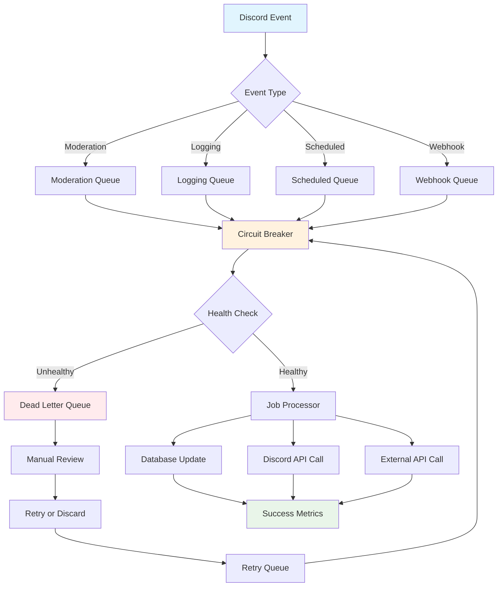

# Queue Flow Architecture

This diagram shows how the unified queue service processes jobs across different components.

## Key Components

### Queue Types

- **Moderation Queue**: Handles bans, kicks, timeouts, and case management
- **Logging Queue**: Processes audit logs and message logging
- **Scheduled Queue**: Manages timed actions like unbans and reminders
- **Webhook Queue**: Handles external webhook deliveries

### Reliability Features

- **Circuit Breaker**: Prevents cascade failures by monitoring success rates
- **Dead Letter Queue**: Captures failed jobs for manual review
- **Retry Logic**: Exponential backoff with configurable retry limits
- **Health Checks**: Monitors queue and processor health

### Processing Flow

1. Discord events are categorized by type
2. Jobs are queued with appropriate priority and metadata
3. Circuit breaker evaluates system health
4. Healthy jobs are processed by dedicated processors
5. Failed jobs are sent to dead letter queue or retry queue
6. Success metrics are collected for monitoring
