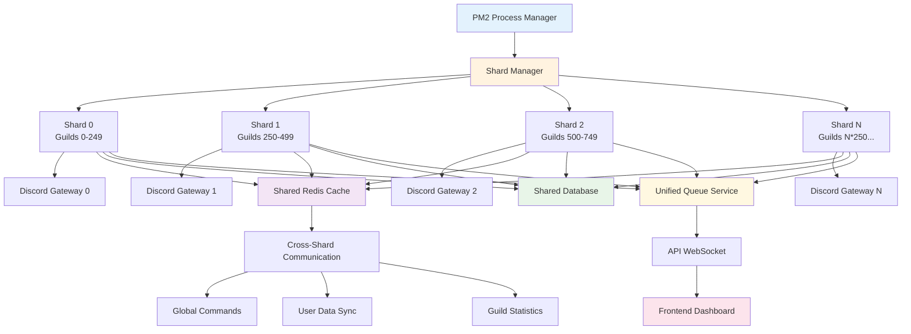

# Discord Bot Sharding Model

This diagram illustrates how the bot handles Discord's sharding requirements for large-scale deployments.

## Sharding Strategy

### Automatic Shard Calculation

- Discord recommends 1 shard per 2,500 guilds
- Bot automatically calculates required shards based on guild count
- Shards are distributed evenly across available processes

### Shard Responsibilities

- **Gateway Connection**: Each shard maintains its own WebSocket connection
- **Event Processing**: Events are processed locally on the responsible shard
- **Guild Management**: Guilds are distributed across shards by ID hash

### Cross-Shard Communication

- **Redis Cache**: Shared state and temporary data across shards
- **Database**: Persistent data accessible by all shards
- **Queue Service**: Centralized job processing and coordination

### Scaling Considerations

- **Horizontal Scaling**: Add more PM2 processes as guild count grows
- **Load Balancing**: PM2 handles process distribution and restarts
- **Memory Management**: Each shard operates independently with isolated memory
- **Fault Tolerance**: Individual shard failures don't affect other shards

### Development vs Production

- **Development**: Single shard for testing and debugging
- **Production**: Multiple shards based on guild count and load requirements
