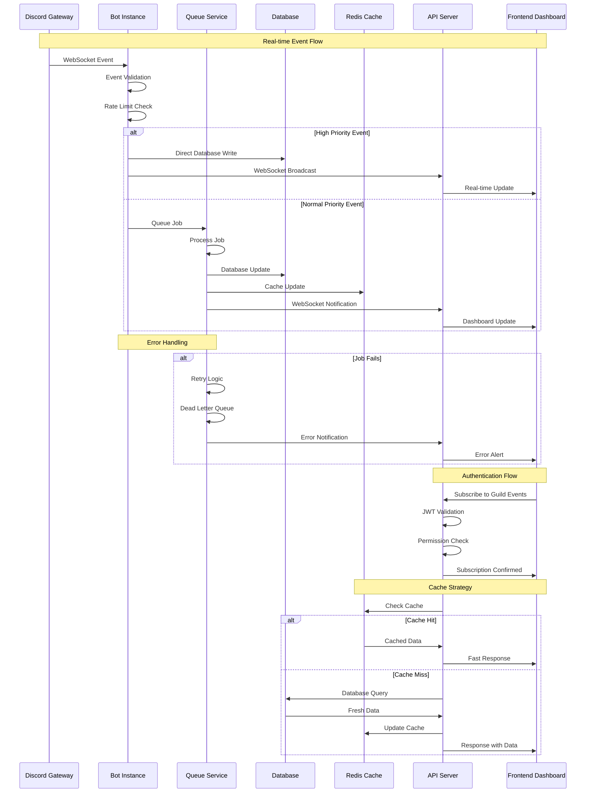

# WebSocket Event Pipeline

This diagram shows the complete flow of WebSocket events from Discord through the bot to the frontend dashboard.

## Event Processing Stages

### 1. Discord Gateway Reception

- **WebSocket Connection**: Persistent connection to Discord
- **Event Validation**: Ensure event structure and authenticity
- **Rate Limiting**: Respect Discord's rate limits

### 2. Bot Processing

- **Event Routing**: Determine appropriate handler
- **Permission Checks**: Verify bot has necessary permissions
- **Context Building**: Gather additional data if needed

### 3. Queue Management

- **Priority Classification**: High priority events bypass queue
- **Job Serialization**: Convert events to processable jobs
- **Circuit Breaker**: Prevent system overload

### 4. Database Operations

- **Atomic Transactions**: Ensure data consistency
- **Optimistic Locking**: Handle concurrent updates
- **Audit Logging**: Track all changes

### 5. Cache Management

- **Write-Through**: Update cache on database writes
- **TTL Management**: Automatic cache expiration
- **Invalidation**: Remove stale data

### 6. API Communication

- **WebSocket Broadcasting**: Real-time updates to connected clients
- **Authentication**: JWT-based session management
- **Permission Filtering**: Users only see authorized data

### 7. Frontend Updates

- **Real-time Dashboard**: Live updates without page refresh
- **Error Handling**: Graceful degradation on connection issues
- **Offline Support**: Queue updates when disconnected

## Performance Optimizations

### Batching

- **Event Aggregation**: Combine similar events
- **Bulk Database Operations**: Reduce connection overhead
- **Compressed Payloads**: Minimize bandwidth usage

### Caching Strategy

- **Multi-Level Cache**: Memory, Redis, and CDN layers
- **Smart Invalidation**: Targeted cache clearing
- **Preemptive Loading**: Anticipate data needs

### Connection Management

- **Connection Pooling**: Reuse database connections
- **WebSocket Scaling**: Handle thousands of concurrent connections
- **Graceful Degradation**: Fallback to polling if WebSocket fails
